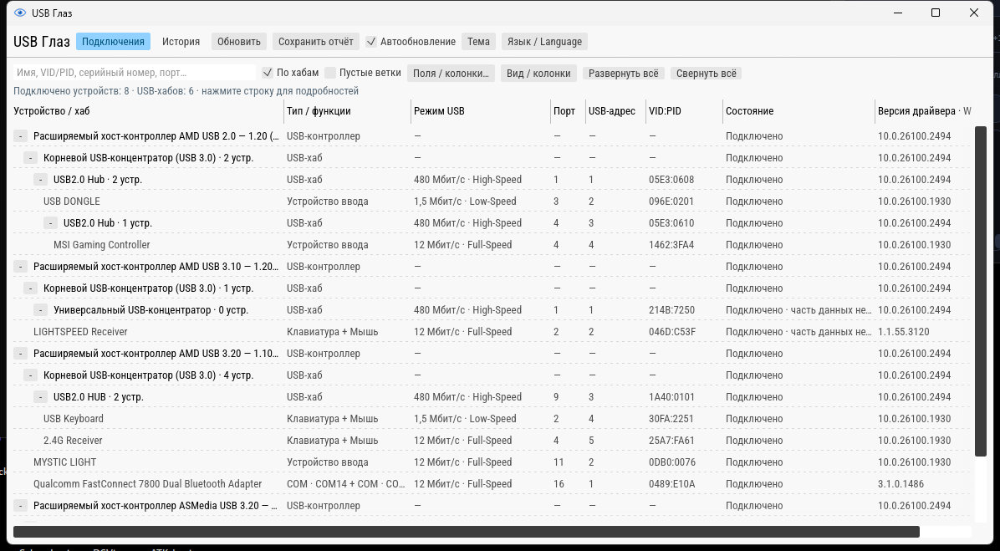
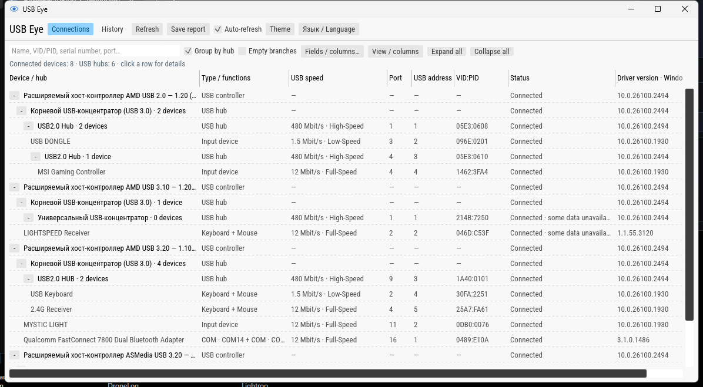

**Поддержать автора / Support the author**

- [Boosty](https://boosty.to/danusha/donate)
- USDT (TRC20): `THyBqiMTWQ7kUH6vVBEdboL7yGLj5mCSrX`
- GRAM (TON): `UQDOgjGljFVJiHo_c9JLuX4hF2UQ2SXqSXhj3-1RefFMA4tB`

---

# USB Глаз / USB Eye

[Русский](#русский) · [English](#english)

## Русский

Компактная утилита для просмотра USB-устройств, хабов и подключений в Windows.
Версия **0.6.1 alpha**. Интерфейс на русском и английском: **Язык / Language**,
выбор сохраняется после перезапуска.

### Скачать и запустить

[GitHub Releases](https://github.com/danusha2345/usb-doctor/releases/tag/v0.6.1-alpha) ·
[GitLab Releases](https://gitlab.com/pipecpriam/usb-doctor/-/releases/v0.6.1-alpha) ·
[Forgejo Releases](https://git.danik2files.ru/danik/usb-doctor/releases/tag/v0.6.1-alpha)

Скачайте **usb-glaz.exe** и запустите. Установка и распаковка не нужны.
Целевая система — Windows 10/11 x64; фактически проверена Windows 11.
Для интерфейса нужен работающий видеодрайвер с поддержкой OpenGL.



### Возможности

- Список подключённых устройств с группировкой и сворачиванием по хабам.
- Обновление по событиям Windows, подсветка изменений на 5 секунд и переход к изменившемуся устройству.
- Выбор любых собранных полей для колонок; изменение ширины и порядка перетаскиванием.
- Поиск, VID/PID, USB-адрес, Instance ID, сведения о драйвере и дескрипторы.
- Светлая, тёмная и системная тема; компактный встроенный шрифт.
- Отчёты HTML/JSON с выбранными полями и настройкой включения идентификаторов.

Нажмите строку устройства для подробностей. **Поля / колонки…** выбирает данные
главной таблицы; **Вид / колонки** управляет её оформлением. Галочки не ограничивают
сбор данных. USB-адрес может изменяться при переподключении и отличается от VID/PID.

**«Подключено · часть данных недоступна»** означает, что некоторые дополнительные
запросы не выполнены; это не доказательство неисправности. Причины доступны в
**Дескрипторы → Не получено / ошибки запросов**. Типы функций распознаются в пределах
поддерживаемых USB-классов; фирменные протоколы автоматически не расшифровываются.
Имена устройств и исходные строки Windows сохраняются на языке источника.
Экспорт сохраняет исходные поля; его формат не меняется при смене языка интерфейса.

Это предварительная версия. Windows 10 пока не проходила отдельную runtime-проверку.
Скорость USB не равна скорости копирования; поля питания описывают заявленные,
а не измеренные значения. Полный сбор сведений выполняется в фоне.

## English

A compact Windows utility for viewing USB devices, hubs and connections.
Version **0.6.1 alpha**. Switch between Russian and English using
**Язык / Language**. Your choice persists after restart.

### Download and run

[GitHub Releases](https://github.com/danusha2345/usb-doctor/releases/tag/v0.6.1-alpha) ·
[GitLab Releases](https://gitlab.com/pipecpriam/usb-doctor/-/releases/v0.6.1-alpha) ·
[Forgejo Releases](https://git.danik2files.ru/danik/usb-doctor/releases/tag/v0.6.1-alpha)

Download **usb-glaz.exe** and run it directly. No installation or extraction needed.
Targets Windows 10/11 x64; runtime-tested on Windows 11.
The interface requires a working graphics driver with OpenGL support.



### Features

- Connected devices, grouped by collapsible hubs.
- Windows event updates, five-second change highlighting and automatic scrolling to changed devices.
- Any collected field as a column; drag headers to reorder and borders to resize.
- Search, VID/PID, USB address, Instance ID, driver information and descriptors.
- Light, dark and system themes; a compact embedded font.
- HTML/JSON reports with selected fields and optional identifiers.

Click a device row for details. **Fields / columns…** selects table data;
**View / columns** controls the layout. Checkboxes do not limit data collection.
A USB address may change after reconnection and is different from VID/PID.

**“Connected · some data unavailable”** means some optional requests failed;
it does not establish a device fault. See **Descriptors → Unavailable / request errors**.
Function recognition covers supported USB classes; proprietary protocols are not
automatically decoded. Device names and raw Windows strings retain their original
language. Exports preserve source fields; the export format does not change with UI language.

This is a preview release. Windows 10 has not yet had a separate runtime test.
USB link speed is not file-copy throughput; power fields are declared values,
not measurements. Full information is collected in the background.

## Документация / Developer documentation

The development documents below are maintained in Russian.

- [Сборка и проверки](docs/BUILD.md).
- [Двуязычный интерфейс 0.6.1](docs/RELEASE_061.md).
- [Скорость, темы и совместимость 0.6.0](docs/RELEASE_06.md).
- [Обзор подключений, колонки и подсветка](docs/INVENTORY_05.md).
- [Покрытие декодеров и ограничения API](docs/research/DESCRIPTOR_DECODERS.md).
- [Проверка на Windows](docs/WINDOWS_LAB.md).
- [Что реализовано и что ещё не проверено](docs/IMPLEMENTATION.md).
- [Матрица возможностей USBTreeView](docs/research/USBTREEVIEW_FEATURE_MATRIX.md).
- [Windows API](docs/research/WINDOWS_API_MAP.md).
- [План проекта](PLAN.md) · [Правила работы](AGENTS.md).

Все три репозитория приватные. Основная ветка — `main`. / All three repositories are private; default branch: `main`.

```sh
jj status
jj diff
codegraph status . --json
codegraph explore --path . "symbol or task"
```

Для нового checkout: `jj git init --colocate`. CodeGraph индексирует Rust и
JavaScript; не индексировать родительские каталоги. Индекс синхронизировать только
при pending changes. CLI остаётся внутренним инструментом диагностики и тестирования,
в пользовательский релиз входит только GUI EXE.
